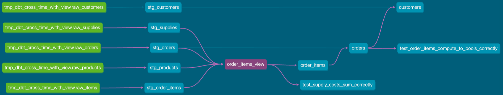

[✏️ 編集](https://github.com/yamamoto-yuta/yamamoto-yuta.github.io/blob/main/content/post/dbt-cross-time-with-view/index.md)

インターステラーのIMAX再上映を観てから、「時の流れ」がマイブームになっています。そんな中、次のアイデアが浮かんで「エモいな」と思ったのでこの記事で少し書いてみたいと思います。

**データそのものは時の流れに逆らえない（ある瞬間に生成された集計結果を過去から利用することはできない）が、その集計ロジックは（大元のデータの構造やロジックに変更が入らない限り）いつ実行しても同じだから時間を超越できる。**

注意:

* 「エモいな」という感情に任せて勢いで書いているので、実践で役に立つかは考慮していません（多分、やらないで済む方向に出来る限り頑張ったほうが良いと思います）
* そもそも普通にもっと良い方法があるかもしれませんので、その際はご指摘いただけると幸いです

## シチュエーション

今回、次のようなシチュエーションを考えます。

元々、次のように並列でジョブが実行されているパイプラインがあったとします。

graph LR
    データ取り込みジョブ --> データ集計ジョブ1 --> データ設置ジョブ1
    データ取り込みジョブ --> データ集計ジョブ2 --> データ設置ジョブ2

後からdbtを導入し、まずデータ集計ジョブ1をdbtに移行しました。続いてデータ集計ジョブ2もdbtに移行しようとしましたが、諸事情（◯時までに×××にデータを設置する必要があり、dbtに移行すると間に合わない、など）でできませんでした。

graph LR
    データ取り込みジョブ --> dbt --> データ設置ジョブ1
    データ取り込みジョブ --> データ集計ジョブ2 --> データ設置ジョブ2

しかし、このままだと集計ロジックがdbtとデータ集計ジョブ2の2つに分散し、管理が煩雑になってしまいます。

## アイデア

この問題に対し、次のアイデアで解決を試みてみます。

データ集計ジョブ2の集計ロジックを `mart_for_job2` モデルとしてdbtに移行します。 `mart_for_job2` モデルは集計ロジックの実装を `mart_for_job2_view` ビュー、実際のデータ保持を `mart_for_job2` テーブルで行うようにします。データ集計ジョブ2は `mart_for_job2_view` ビューを呼び出すことで集計処理を行うようにします。

graph LR
    データ取り込みジョブ
    subgraph dbt
        stg_hoge
        stg_bar
        subgraph mart_for_job2モデル
            mart_for_job2_view
            mart_for_job2
        end
    end
    データ設置ジョブ1
    データ集計ジョブ2
    データ設置ジョブ2
    stg_hoge --> mart_for_job2_view
    stg_bar --> mart_for_job2_view
    mart_for_job2_view --> mart_for_job2
    データ取り込みジョブ --> dbt --> データ設置ジョブ1
    データ取り込みジョブ --> データ集計ジョブ2 --> データ設置ジョブ2
    mart_for_job2_view -. 呼び出し .-> データ集計ジョブ2

こうすることで、ジョブが分かれていても集計ロジックはdbtへ集約させることができます。

時間に着目して言い換えると、データ集計ジョブ2は本来 `mart_for_job2` テーブルに格納されてからでないと使えないはずの集計結果をそれより前に使えていることになります。これは時の流れを超越したと言っても過言ではないでしょうか（過言）。

## 実際に実装してみた

次のデータリネージを持つdbtプロジェクトを作成し、 `order_items` モデルをデータ集計ジョブ2で使う想定で `order_items_view` ビューを実装しました。

実装したリポジトリがこちらです。

https://github.com/yamamoto-yuta/dbt-cross-time-with-view

## アイデアの限界

共通データマートを使いたい場合、使いたいテーブルができるまでの全てのdbtモデルでビューを作成する必要があります。dbtの実行完了より先にデータ集計ジョブ2が動き始めるため、dbtで作成したテーブルは使えません。

例えば、 `mart_for_job2` モデルで共通データマートである `dim_foo` モデルを使いたい場合、次のようにする必要があります。

graph LR
    データ取り込みジョブ
    subgraph dbt
        stg_hoge
        stg_bar
        subgraph dim_fooモデル
            dim_foo_view
            dim_foo
        end
        subgraph mart_for_job2モデル
            mart_for_job2_view
            mart_for_job2
        end
    end
    データ設置ジョブ1
    データ集計ジョブ2
    データ設置ジョブ2
    stg_hoge --> dim_foo_view
    stg_bar --> dim_foo_view
    dim_foo_view --> dim_foo
    dim_foo_view --> mart_for_job2_view
    mart_for_job2_view --> mart_for_job2
    データ取り込みジョブ --> dbt --> データ設置ジョブ1
    データ取り込みジョブ --> データ集計ジョブ2 --> データ設置ジョブ2
    mart_for_job2_view -. 呼び出し .-> データ集計ジョブ2

これにより、データリネージが本来より複雑になります。これはdbt docsの使い勝手やdbt testの行いやすさなどに影響を与える可能性があります。

このあたりはCustom Materializationを使えば（1つのdbtモデルでビューとテーブルの2つを実体化できるようなmaterializationを自作する、など）改善できるかもしれません（要検証）。

## 結び

この記事では、ビューを使ってジョブの実行順によらず集計ロジックをdbtへ集約するアイデアについて記しました。

冒頭にも書いた通り、「エモいな」という感情に任せて勢いで書いてますし、多分やらないで済む方向で出来る限り頑張ったほうが良いと思います。

とはいえ、今回挙げたシチュエーションに実際に陥ってしまったなど、何かしらお役に立てれば幸いです🙇

